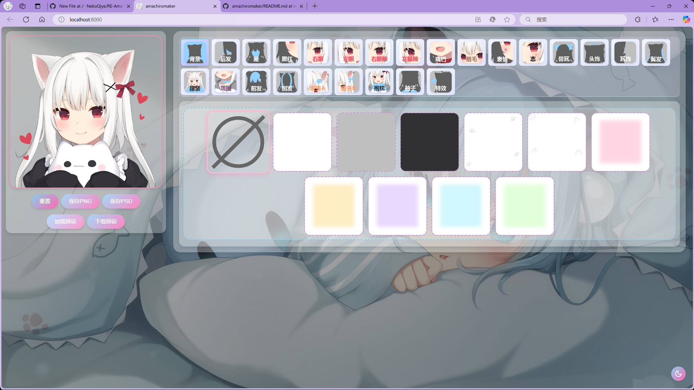

# Amachiromaker ✨

这个项目公布了被甘城猫猫下线的捏脸网站

本项目基于NekoQiye的Amachiromaker进行了图片获取

公开Amachiromaker源码，可以自己随意搭建。

  
  
<em>实时角色编辑效果预览[此动图来自NekoQiye]</em>

## 🎨 核心功能

- **多层角色设计**
  - 50+ 可组合部件（发型/眼睛/服装）
  - 实时颜色调整
  - 图层混合模式

- **导出选项**
  - 透明背景PNG
  - 分层PSD文件
  - JSON预设保存/加载

## 📸 界面截图

  
  
<em>直观的编辑界面[来自NekoQiye]</em>

## 🚀 快速开始

### 开发环境
## Node.js
